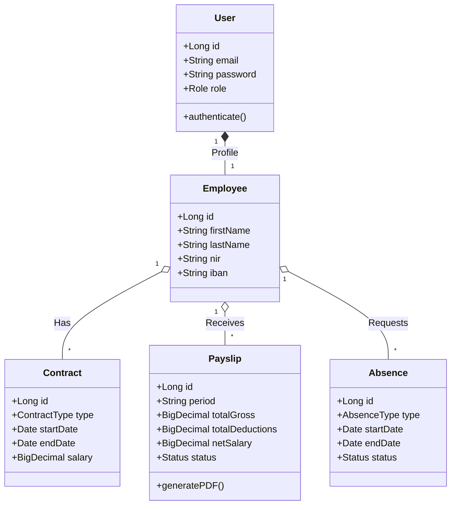
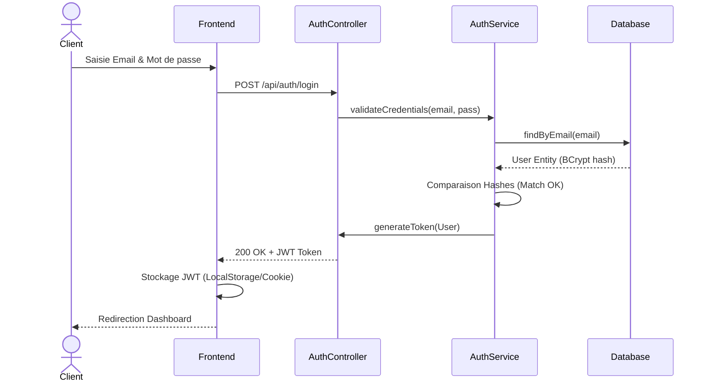
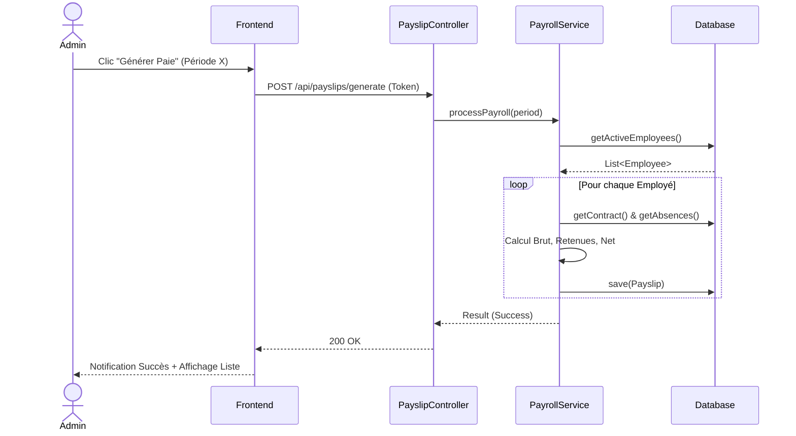

# Architecture Logicielle - Application Memoire

## Sommaire

- [1. Vue d&#39;Ensemble Architecturale](#1-vue-densemble-architecturale)
- [2. Structure des Composants Backend](#2-structure-des-composants-backend)
- [3. Structure du Frontend](#3-structure-du-frontend)
- [4. Flux d&#39;Authentification](#4-flux-dauthentification)
- [5. Flux de Création de Bulletin de Paie](#5-flux-de-création-de-bulletin-de-paie)
- [6. Sécurité et Patterns](#6-sécurité-et-patterns)
- [7. Base de Données - Relations](#7-base-de-données---relations)
- [8. Performance et Optimisation](#8-performance-et-optimisation)

## 1. Vue d'Ensemble Architecturale

### 1.1 Pattern Architectural

L'application suit une **architecture Monolithique avec une séparation en N-Tiers logique** (MVC).

Ce choix a été fait volontairement pour éviter le sur-design (over-engineering) au vu de la taille de l'équipe (1 personne) : le front-end et le back-end sont hébergés ensemble et livrés dans un seul bloc (Monolithe), mais le code est strictement découplé à l'intérieur.
L'application communique via une **API REST** interne. S'il fallait la faire évoluer vers un vrai système en microservices ou 3-Tiers physique, il suffirait d'extraire le dossier `static` sur un serveur dédié.

La séparation logique s'organise ainsi :

- **Présentation** (Frontend Vanilla JS)
- **Business Logic** (Services Spring Boot)
- **Persistance** (Repository JPA)
- **Data** (Base de données)

### 1.2 Diagramme Architectural (Vue Générale)

```
┌─────────────────────────────────────────────────────────────┐
│                    CLIENT LAYER                              │
│  ┌──────────────────────────────────────────────────────┐  │
│  │  Frontend (HTML/CSS/JS)                               │  │
│  │  - index.html (SPA)                                   │  │
│  │  - Views (Dashboard, Employees, Payslips, etc.)      │  │
│  │  - API Client (api.js)                                │  │
│  └──────────────────────────────────────────────────────┘  │
└────────────────────────┬─────────────────────────────────────┘
                         │ HTTP/JSON
┌────────────────────────▼─────────────────────────────────────┐
│                    SERVER LAYER                               │
│  ┌──────────────────────────────────────────────────────┐  │
│  │  Presentation Layer (Controllers)                    │  │
│  │  - AuthController                                    │  │
│  │  - UserController                                    │  │
│  │  - EmployeeController                                │  │
│  │  - PayslipController                                 │  │
│  │  - AbsenceController                                 │  │
│  └──────────────────────────────────────────────────────┘  │
│                         │                                    │
│  ┌──────────────────────▼──────────────────────────────┐  │
│  │  Business Layer (Services)                           │  │
│  │  - UserService                                       │  │
│  │  - EmployeeService                                   │  │
│  │  - PayrollService                                    │  │
│  │  - AbsenceService                                    │  │
│  │  - ContractService                                   │  │
│  └──────────────────────────────────────────────────────┘  │
│                         │                                    │
│  ┌──────────────────────▼──────────────────────────────┐  │
│  │  Data Layer (Repositories)                           │  │
│  │  - UserRepository                                    │  │
│  │  - EmployeeRepository                                │  │
│  │  - PayslipRepository                                 │  │
│  │  - AbsenceRepository                                 │  │
│  │  - ContractRepository                                │  │
│  └──────────────────────────────────────────────────────┘  │
└────────────────────────┬─────────────────────────────────────┘
                         │ JDBC
┌────────────────────────▼─────────────────────────────────────┐
│                    DATABASE LAYER                             │
│  ┌──────────────────────────────────────────────────────┐  │
│  │  Relational Database (MySQL/PostgreSQL)              │  │
│  │  - Users, Employees, Contracts, Positions           │  │
│  │  - Payslips, Absences, LeaveBalance                 │  │
│  │  - PayrollElements, Establishments                   │  │
│  └──────────────────────────────────────────────────────┘  │
└──────────────────────────────────────────────────────────────┘
```

## 2. Structure des Composants Backend

### 2.1 Couche de Présentation (Controllers)

```
Controllers/
├── AuthController
│   ├── POST /auth/login
│   ├── POST /auth/logout
│   ├── POST /auth/refresh-token
│   └── POST /auth/reset-password
│
├── UserController
│   ├── GET /users (avec pagination)
│   ├── GET /users/{id}
│   ├── POST /users
│   ├── PUT /users/{id}
│   └── DELETE /users/{id}
│
├── EmployeeController
│   ├── GET /employees (avec filtres)
│   ├── GET /employees/{id}
│   ├── GET /employees/{id}/contracts
│   ├── GET /employees/{id}/absences
│   ├── GET /employees/{id}/payslips
│   ├── POST /employees
│   ├── PUT /employees/{id}
│   └── DELETE /employees/{id}
│
├── ContractController
│   ├── GET /contracts
│   ├── GET /contracts/{id}
│   ├── POST /contracts
│   ├── PUT /contracts/{id}
│   └── DELETE /contracts/{id}
│
├── PayslipController
│   ├── GET /payslips
│   ├── GET /payslips/{id}
│   ├── POST /payslips
│   ├── PUT /payslips/{id}
│   ├── POST /payslips/{id}/validate
│   └── GET /payslips/{id}/export
│
└── AbsenceController
    ├── GET /absences
    ├── POST /absences
    ├── PUT /absences/{id}/approve
    └── PUT /absences/{id}/reject
```

### 2.2 Couche Métier (Services)

```
Services/
├── AuthService
│   ├── authenticate(email, password)
│   ├── generateToken()
│   ├── validateToken()
│   └── resetPassword()
│
├── UserService
│   ├── getAllUsers()
│   ├── getUserById()
│   ├── createUser()
│   ├── updateUser()
│   └── deleteUser()
│
├── EmployeeService
│   ├── getAllEmployees()
│   ├── getEmployeeDetails()
│   ├── createEmployee()
│   ├── updateEmployee()
│   └── getEmployeePayslips()
│
├── PayrollService
│   ├── generatePayslip()
│   ├── calculateSalary()
│   ├── calculateTaxes()
│   ├── calculateContributions()
│   ├── validatePayslip()
│   └── exportPayslip()
│
├── AbsenceService
│   ├── requestAbsence()
│   ├── approveAbsence()
│   ├── rejectAbsence()
│   ├── calculateLeaveBalance()
│   └── getAbsenceHistory()
│
├── ContractService
│   ├── createContract()
│   ├── updateContract()
│   └── getContractHistory()
│
└── UtilityServices
    ├── EmailService (notifications)
    ├── ExportService (PDF, Excel)
    └── ReportService (rapports)
```

### 2.3 Couche Données (Repositories)

```
Repositories/
├── UserRepository extends JpaRepository
│   ├── findByEmail()
│   ├── findByRole()
│   └── Custom queries
│
├── EmployeeRepository extends JpaRepository
│   ├── findByEstablishment()
│   ├── findByPosition()
│   └── Custom queries
│
├── ContractRepository extends JpaRepository
│   ├── findByEmployee()
│   ├── findActiveContracts()
│   └── Custom queries
│
├── PayslipRepository extends JpaRepository
│   ├── findByEmployee()
│   ├── findByPeriod()
│   └── Custom queries
│
├── AbsenceRepository extends JpaRepository
│   ├── findByEmployee()
│   ├── findByStatus()
│   └── Custom queries
│
└── ... (autres repositories)
```

### 2.4 Modèles de Données (JPA Entities)



## 3. Structure du Frontend

### 3.1 Architecture SPA

```Markdown
index.html (Point d'entrée unique)
    ↓
app.js (Initialisation)
    ├→ router.js (Navigation)
    ├→ state.js (Gestion d'état global)
    ├→ api.js (Appels API)
    ├→ ui.js (Utilitaires UI)
    │
    └→ views/ (Composants de vue)
        ├── login.js (Authentification)
        ├── dashboard.js (Accueil)
        ├── employees.js (Liste employés)
        ├── navbar.js (Navigation)
        ├── payslips.js (Bulletins de paie)
        ├── absences.js (Gestion absences)
        └── settings.js (Paramètres)
```

### 3.2 Flux de Données Frontend

```
Router (URL change)
    ↓
View Loading
    ↓
API Call (api.js)
    ↓ API Response
State Update (state.js)
    ↓
UI Render (ui.js)
    ↓
DOM Update
    ↓
User Interaction
```

### 3.3 CSS Architecture

```
css/
├── base/
│   ├── variables.css (CSS variables)
│   ├── base.css (Reset, styles par défaut)
│   └── layout.css (Layout global, flexbox, grid)
│
└── components/
    ├── auth.css
    ├── buttons.css
    ├── cards.css
    ├── forms.css
    ├── modals.css
    ├── tables.css
    ├── payroll.css
    ├── avatars.css
    ├── badges.css
    └── toasts.css (Notifications)
```

## 4. Flux d'Authentification (JWT)

> 🔗 *Voir le [Diagramme de Séquence détaillé de l&#39;Authentification](../06_Workflow/flux/01_auth_workflow.md)*



## 5. Flux de Création de Bulletin de Paie

> 🔗 *Voir le [Diagramme de Séquence détaillé de la Paie](../06_Workflow/flux/02_generation_paie_workflow.md)*
> 🔗 *Voir le [Processus de Gestion des Employés](../06_Workflow/flux/03_gestion_employes_workflow.md)*



## 6. Sécurité et Patterns

### 6.1 Patterns de Sécurité

- **Authentication:** JWT ou Session-based auth
- **Authorization:** RBAC (Role-Based Access Control)
- **Input Validation:** Validation côté serveur et client
- **SQL Injection Prevention:** Parameterized queries (JPA)
- **XSS Prevention:** Escaping de données
- **CSRF Protection:** Tokens CSRF

### 6.2 Hiérarchie des Rôles

```
ADMIN (ou RH)
├── Accès complet à l'application
├── Gestion des employés et des établissements
└── Génération et gestion des fiches de paie

EMPLOYEE (Salarié)
├── Consultation de ses propres informations
└── Téléchargement de ses fiches de paie historiques
```

## 7. Base de Données - Relations

```
User 1---∞ Employee
Employee 1---∞ Contract
Employee 1---∞ Payslip
Employee 1---∞ Absence
Contract M---N Position
Contract M---N Establishment
Payslip 1---∞ PayslipLine
PayslipLine M---N PayrollElement
Absence M---N AbsenceType
```

## 8. Performance et Optimisation

### 8.1 Strategies

- **Lazy Loading:** Charger les données à la demande
- **Pagination:** Limiter les résultats
- **Caching:** Redis pour données fréquemment accédées
- **Indexing:** Indexes sur les colonnes de recherche
- **Async Processing:** Tasks asynchrones pour opérations lourdes

### 8.2 Monitoring

- **Logs:** Application logs
- **Metrics:** Performance metrics
- **Alerts:** Alertes sur anomalies

---

*Dernière mise à jour: 2026-08-23*

[⬅️ Retour à l&#39;Index principal](../INDEX.md)
