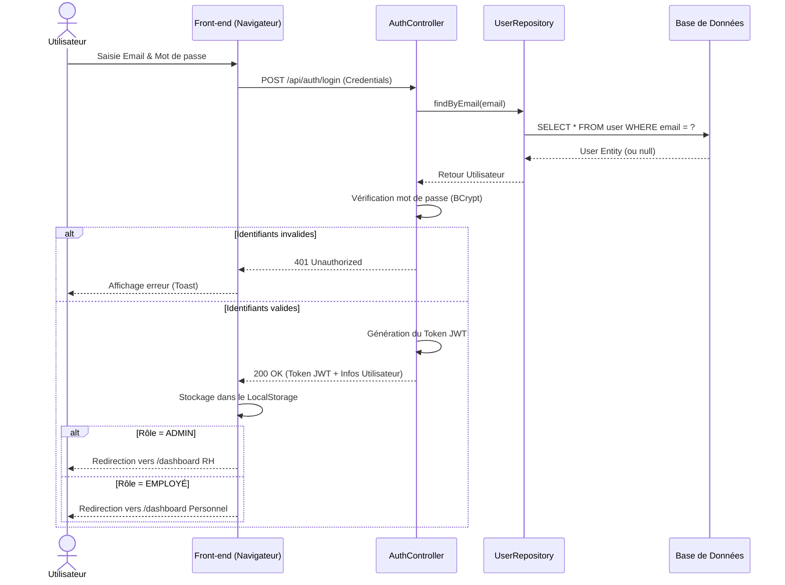

# Workflow : Authentification et Routage

Ce diagramme de séquence décrit les interactions entre l'utilisateur, l'interface et le serveur lors de la connexion.

### Explication flèche par flèche

- **`U->>F: Saisie Email & Mot de passe`** : L'Utilisateur (U) tape ses identifiants dans le formulaire affiché sur le Navigateur (F).
- **`F->>C: POST /api/auth/login (Credentials)`** : Le Navigateur (F) envoie une requête HTTP POST contenant les identifiants au Contrôleur d'authentification (C).
- **`C->>R: findByEmail(email)`** : Le Contrôleur (C) demande au Repository (R) de chercher un compte correspondant à cet email.
- **`R->>DB: SELECT * FROM user WHERE email = ?`** : Le Repository (R) exécute la requête SQL pour chercher l'utilisateur dans la Base de Données (DB).
- **`DB-->>R: User Entity (ou null)`** : La Base de Données (DB) renvoie les données de l'utilisateur (ou rien s'il n'existe pas) au Repository (R).
- **`R-->>C: Retour Utilisateur`** : Le Repository (R) transmet l'objet Utilisateur trouvé au Contrôleur (C).
- **`C->>C: Vérification mot de passe (BCrypt)`** : Le Contrôleur (C) compare en interne le mot de passe reçu avec celui de la base de données via l'algorithme BCrypt.

**Scénario 1 : Identifiants invalides (`alt Identifiants invalides`)**

- **`C-->>F: 401 Unauthorized`** : Le Contrôleur (C) renvoie un code d'erreur HTTP 401 au Navigateur (F).
- **`F-->>U: Affichage erreur (Toast)`** : Le Navigateur (F) affiche une notification visuelle d'erreur à l'Utilisateur (U).

**Scénario 2 : Identifiants valides (`else Identifiants valides`)**

- **`C->>C: Génération du Token JWT`** : Le Contrôleur (C) génère en interne un jeton de sécurité JWT signé.
- **`C-->>F: 200 OK (Token JWT + Infos Utilisateur)`** : Le Contrôleur (C) renvoie un succès (200 OK) avec le Token et les infos de l'utilisateur au Navigateur (F).
- **`F->>F: Stockage dans le LocalStorage`** : Le Navigateur (F) sauvegarde le Token JWT dans sa mémoire locale (LocalStorage) pour les prochaines requêtes.

**Sous-scénario de Routage :**

- **`F-->>U: Redirection vers /dashboard RH`** : Si le rôle est ADMIN, le Navigateur (F) redirige l'Utilisateur (U) vers l'espace RH.
- **`F-->>U: Redirection vers /dashboard Personnel`** : Si le rôle est EMPLOYÉ, le Navigateur (F) redirige l'Utilisateur (U) vers son espace personnel.
