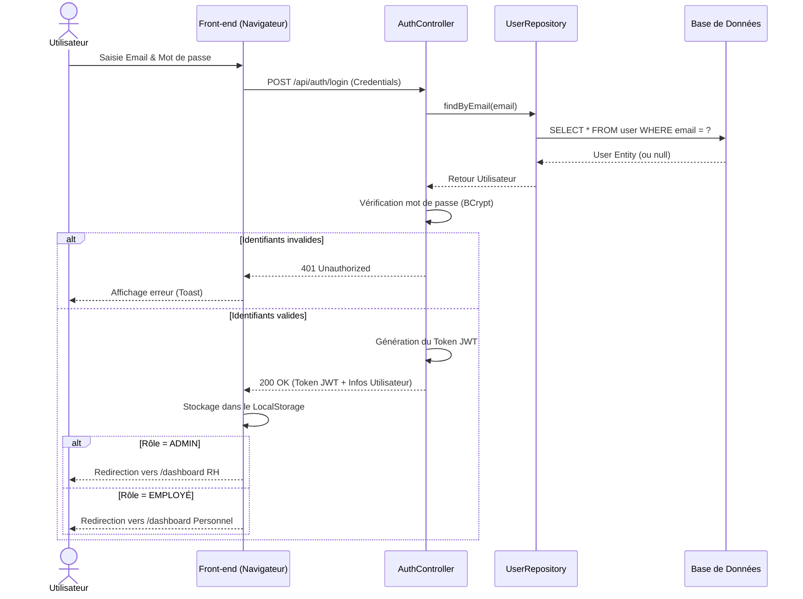

# Workflow : Authentification et Routage

Ce diagramme de séquence décrit les interactions entre l'utilisateur, l'interface et le serveur lors de la connexion.

```mermaid
sequenceDiagram
    actor U as Utilisateur
    participant F as Front-end (Navigateur)
    participant C as AuthController
    participant R as UserRepository
    participant DB as Base de Données
  
    U->>F: Saisie Email & Mot de passe
    F->>C: POST /api/auth/login (Credentials)
    C->>R: findByEmail(email)
    R->>DB: SELECT * FROM user WHERE email = ?
    DB-->>R: User Entity (ou null)
    R-->>C: Retour Utilisateur
    C->>C: Vérification mot de passe (BCrypt)
    alt Identifiants invalides
        C-->>F: 401 Unauthorized
        F-->>U: Affichage erreur (Toast)
    else Identifiants valides
        C->>C: Génération du Token JWT
        C-->>F: 200 OK (Token JWT + Infos Utilisateur)
        F->>F: Stockage dans le LocalStorage
        alt Rôle = ADMIN
            F-->>U: Redirection vers /dashboard RH
        else Rôle = EMPLOYÉ
            F-->>U: Redirection vers /dashboard Personnel
        end
    end
```
