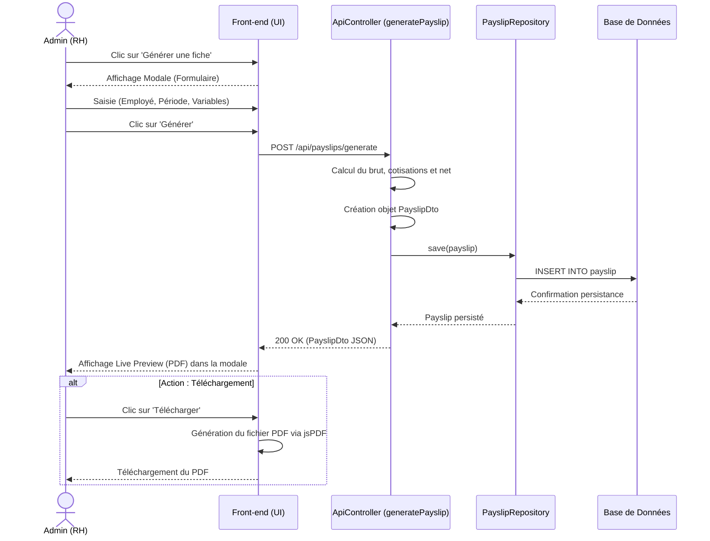

# Workflow : Génération d'une Fiche de Paie

Ce diagramme de séquence illustre la communication technique lors du calcul et de la création d'un bulletin de salaire.

```mermaid
sequenceDiagram
    actor A as Admin (RH)
    participant F as Front-end (UI)
    participant C as ApiController (generatePayslip)
    participant R as PayslipRepository
    participant DB as Base de Données
  
    A->>F: Clic sur 'Générer une fiche'
    F-->>A: Affichage Modale (Formulaire)
    A->>F: Saisie (Employé, Période, Variables)
    A->>F: Clic sur 'Générer'
    F->>C: POST /api/payslips/generate
    C->>C: Calcul du brut, cotisations et net
    C->>C: Création objet PayslipDto
    C->>R: save(payslip)
    R->>DB: INSERT INTO payslip
    DB-->>R: Confirmation persistance
    R-->>C: Payslip persisté
    C-->>F: 200 OK (PayslipDto JSON)
    F-->>A: Affichage Live Preview (PDF) dans la modale
  
    alt Action : Téléchargement
        A->>F: Clic sur 'Télécharger'
        F->>F: Génération du fichier PDF via jsPDF
        F-->>A: Téléchargement du PDF
    end
```
