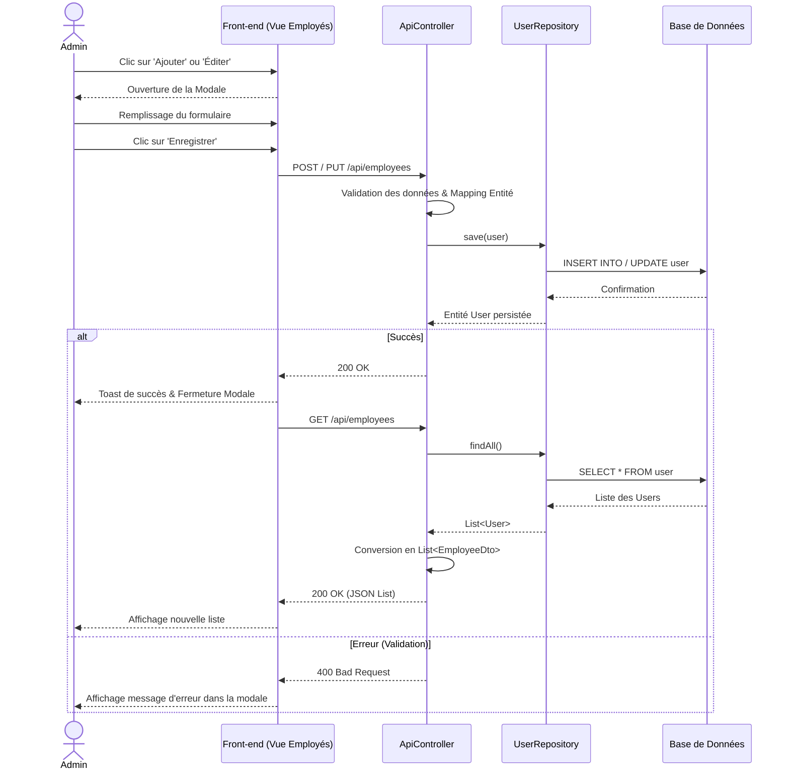

# Workflow : Gestion des Employés (CRUD)

Ce diagramme met en évidence la nature asynchrone des actions de l'administrateur sans rechargement de page.

```mermaid
sequenceDiagram
    actor A as Admin
    participant F as Front-end (Vue Employés)
    participant C as ApiController
    participant R as UserRepository
    participant DB as Base de Données
  
    A->>F: Clic sur 'Ajouter' ou 'Éditer'
    F-->>A: Ouverture de la Modale
    A->>F: Remplissage du formulaire
    A->>F: Clic sur 'Enregistrer'
    F->>C: POST / PUT /api/employees
    C->>C: Validation des données & Mapping Entité
    C->>R: save(user)
    R->>DB: INSERT INTO / UPDATE user
    DB-->>R: Confirmation
    R-->>C: Entité User persistée
  
    alt Succès
        C-->>F: 200 OK
        F-->>A: Toast de succès & Fermeture Modale
        F->>C: GET /api/employees
        C->>R: findAll()
        R->>DB: SELECT * FROM user
        DB-->>R: Liste des Users
        R-->>C: List<User>
        C->>C: Conversion en List<EmployeeDto>
        C-->>F: 200 OK (JSON List)
        F-->>A: Affichage nouvelle liste
    else Erreur (Validation)
        C-->>F: 400 Bad Request
        F-->>A: Affichage message d'erreur dans la modale
    end
```
