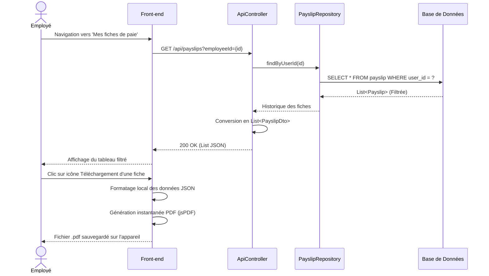

# Workflow : Consultation des Fiches de Paie (Côté Employé)

Ce diagramme de séquence montre un flux de consultation "Read-Only" pour l'employé.

### Explication flèche par flèche

**Phase 1 : Consultation de l'historique**

- **`E->>F: Navigation vers 'Mes fiches de paie'`** : L'Employé (E) clique sur l'onglet de navigation pour consulter son historique sur le Front-end (F).
- **`F->>C: GET /api/payslips?employeeId={id}`** : Le Front-end (F) envoie une requête HTTP GET au Contrôleur (C) pour récupérer les fiches de l'employé spécifique.
- **`C->>R: findByUserId(id)`** : Le Contrôleur (C) fait appel au Repository (R) pour récupérer uniquement les fiches de cet employé.
- **`R->>DB: SELECT * FROM payslip WHERE user_id = ?`** : Le Repository (R) exécute la requête SQL filtrée directement dans la Base de Données (DB).
- **`DB-->>R: List<Payslip> (Filtrée)`** : La Base de Données (DB) renvoie la liste déjà filtrée au Repository (R).
- **`R-->>C: Historique des fiches`** : Le Repository (R) transmet ces données pertinentes au Contrôleur (C).
- **`C->>C: Conversion en List<PayslipDto>`** : Le Contrôleur (C) convertit les entités de base de données en objets DTO (Data Transfer Object) pour un envoi optimisé.
- **`C-->>F: 200 OK (List JSON)`** : Le Contrôleur (C) renvoie la liste finale au format texte JSON avec un statut de succès (200 OK) au Front-end (F).
- **`F-->>E: Affichage du tableau filtré`** : Le Front-end (F) génère le tableau visuel et l'affiche à l'Employé (E).

**Phase 2 : Génération et téléchargement du PDF**

- **`E->>F: Clic sur icône Téléchargement d'une fiche`** : L'Employé (E) clique sur le bouton pour télécharger une fiche spécifique sur le Front-end (F).
- **`F->>F: Formatage local des données JSON`** : Le Front-end (F) structure les données JSON qu'il possède déjà en mémoire.
- **`F->>F: Génération instantanée PDF (jsPDF)`** : Le Front-end (F) dessine le document PDF entièrement côté client grâce à la librairie jsPDF, sans avoir besoin de redemander quoi que ce soit au serveur.
- **`F-->>E: Fichier .pdf sauvegardé sur l'appareil`** : Le navigateur sauvegarde physiquement le fichier PDF sur l'ordinateur de l'Employé (E).
