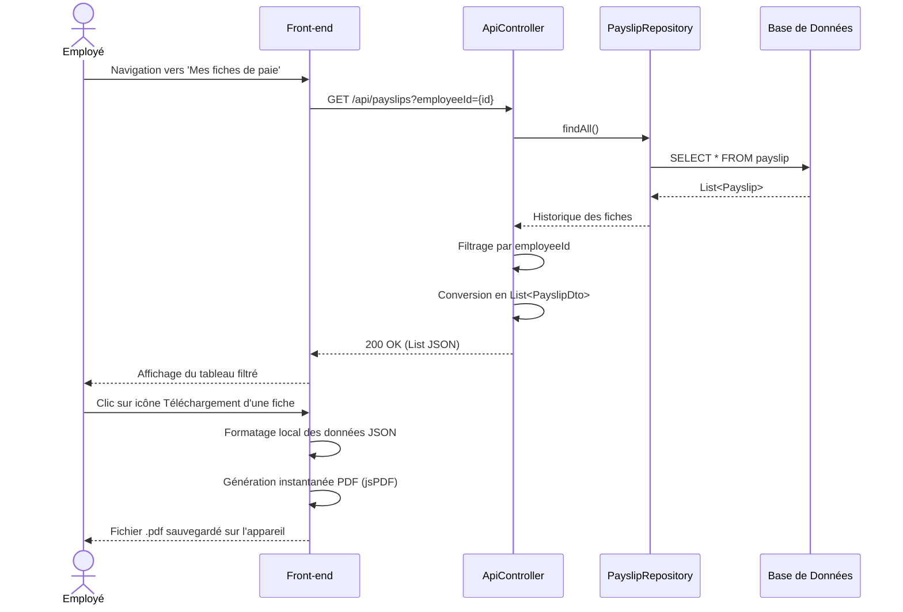

# Workflow : Consultation des Fiches de Paie (Côté Employé)

Ce diagramme de séquence montre un flux de consultation "Read-Only" pour l'employé.

```mermaid
sequenceDiagram
    actor E as Employé
    participant F as Front-end
    participant C as ApiController
    participant R as PayslipRepository
    participant DB as Base de Données
  
    E->>F: Navigation vers 'Mes fiches de paie'
    F->>C: GET /api/payslips?employeeId={id}
    C->>R: findAll()
    R->>DB: SELECT * FROM payslip
    DB-->>R: List<Payslip>
    R-->>C: Historique des fiches
    C->>C: Filtrage par employeeId
    C->>C: Conversion en List<PayslipDto>
    C-->>F: 200 OK (List JSON)
    F-->>E: Affichage du tableau filtré
  
    E->>F: Clic sur icône Téléchargement d'une fiche
    F->>F: Formatage local des données JSON
    F->>F: Génération instantanée PDF (jsPDF)
    F-->>E: Fichier .pdf sauvegardé sur l'appareil
```
