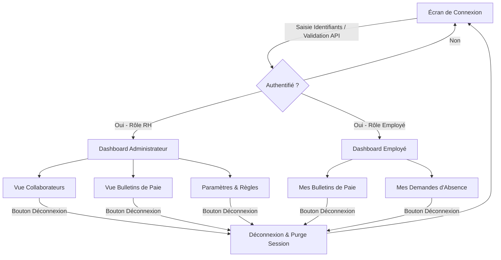
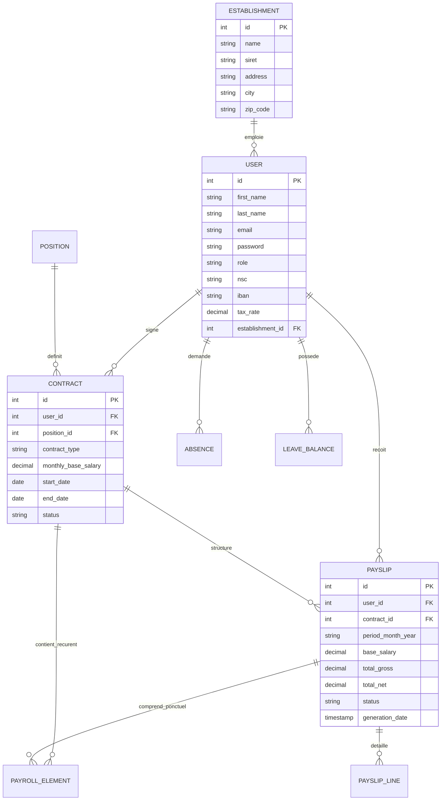
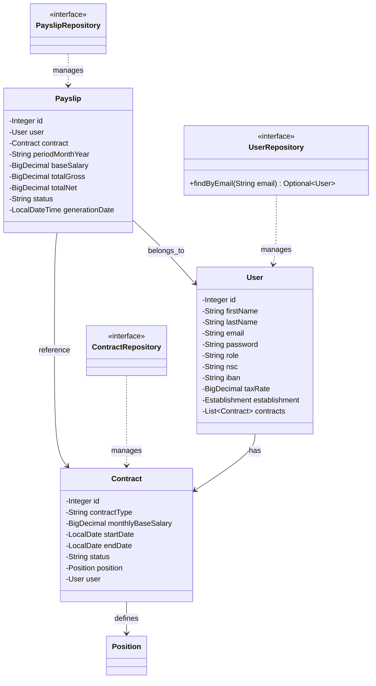
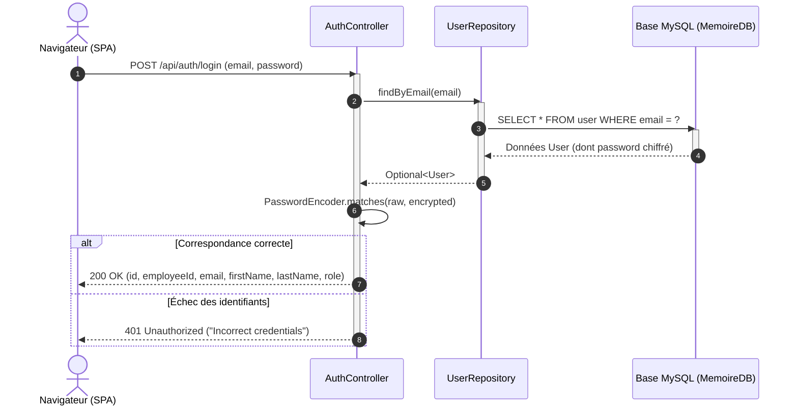

# Le projet GFPS (Génération de Fiches de Paie Simplifiées)

**Pour Titre Professionnel - Concepteur Développeur d'Applications (CDA)**

* **Présenté par** : Victor Alves Fernandes
* **Formation** : CDA
* **Année universitaire** : 2025-2026
* **Entreprise d’accueil** : Eiffage
* **Tuteur entreprise** : Béatrice Rivoire
* **CFA** : CFA INSTA

---

## Avant-propos

Ce mémoire est le fruit d’un travail réalisé dans le cadre de mon alternance au sein du service A-MOA d’Eiffage et de ma formation de Concepteur Développeur d'Applications au sein du CFA INSTA.

Il reflète à la fois une expérience professionnelle particulièrement enrichissante et une démarche rigoureuse d’ingénierie logicielle.

Le projet GFPS (Génération de Fiches de Paie Simplifiées) répond à un besoin critique de fiabilisation et de centralisation des données des ressources humaines.

Ce document a pour ambition de présenter les solutions techniques, architecturales et ergonomiques apportées, tout en s’appuyant sur des concepts de développement modernes.

---

## Remerciements

La réalisation de ce mémoire et l'aboutissement de ce projet n'auraient pu être possibles sans l'accompagnement et la bienveillance de nombreuses personnes, que je tiens ici à remercier chaleureusement.

Mes remerciements les plus sincères s'adressent tout d'abord à l'ensemble de l'équipe pédagogique du CFA INSTA. Je remercie particulièrement mes formateurs pour la qualité de leurs enseignements, leur disponibilité et leurs conseils avisés qui m'ont permis de monter en compétences tout au long de ce cursus.

Je tiens ensuite à exprimer ma profonde gratitude à mon entreprise d'accueil, le groupe Eiffage, et plus particulièrement au service A-MOA. Un grand merci à ma tutrice, Madame Béatrice RIVOIRE, pour son encadrement, sa confiance et le temps précieux qu'elle m'a accordé. Son expertise métier et ses retours constructifs ont été de véritables moteurs dans la réussite de mes missions.

Je remercie également mes collègues de l'équipe informatique et du service RH pour leur accueil chaleureux, leur esprit d'entraide et les échanges techniques stimulants que nous avons pu avoir au quotidien.

Enfin, je remercie ma famille et mes proches pour leur soutien indéfectible et leurs encouragements constants, ainsi que les membres du jury pour le temps consacré à la lecture et à l'évaluation de ce travail de fin d'études.

---

## Résumé du Projet : Paymaster Pro (GFPS)

Au sein de mon entreprise d'accueil, le groupe Eiffage, je suis chargé d'accompagner le service A-MOA en tant que Maintenance Légère. Les outils de paie actuels (GXP, Business Objects, ACE) étant fragmentés et sources de nombreuses saisies manuelles chronophages, j'ai entrepris de créer une plateforme innovante et centralisée : PayMaster Pro (projet GFPS). Je souhaite fournir aux gestionnaires RH une solution pour automatiser leurs calculs de salaires de manière fiable, tout en leur permettant de reprendre le contrôle total sur les règles de gestion.

En parallèle, je souhaite offrir aux employés de l'entreprise une expérience fluide et autonome. Une fonctionnalité clé de la plateforme est la mise à disposition d'un portail "self-service" où les salariés peuvent consulter en temps réel l'évolution de leurs compteurs de congés, soumettre leurs demandes d'absence et accéder à leurs fiches de paie. Cette approche leur permet de s'impliquer directement dans leurs démarches administratives, tout en offrant aux ressources humaines un suivi transparent et instantané. Ainsi, les collaborateurs et les administrateurs interagissent au sein d'un écosystème unique, mis à jour au fur et à mesure des événements.

Mon ambition est de fournir un MVP (Minimum Viable Product) fonctionnel sous forme de Proof of Concept (PoC), en respectant scrupuleusement les exigences de qualité technique et de sécurité que j'ai définies (architecture Java/Spring Boot, authentification JWT). Je suis déterminé à concrétiser cette vision et à offrir à Eiffage une plateforme novatrice pour moderniser sa gestion de la paie et réduire sa dépendance aux éditeurs tiers.

### Project Summary: Paymaster Pro (GFPS)

Within my host company, the Eiffage Group, I am responsible for supporting the A-MOA department in a Light Maintenance role. Since the current payroll tools (GXP, Business Objects, ACE) are fragmented and lead to numerous time-consuming manual data entries, I undertook the creation of an innovative and centralized platform: PayMaster Pro (GFPS project). I aim to provide HR managers with a solution to reliably automate their salary calculations, while allowing them to regain full control over the management rules.

In parallel, I want to offer the company's employees a seamless and autonomous experience. A key feature of the platform is the provision of a "self-service" portal where employees can view their leave balances in real-time, submit absence requests, and access their payslips. This approach allows them to be directly involved in their administrative procedures, while providing human resources with transparent and instant tracking. Thus, employees and administrators interact within a single ecosystem, updated as events occur.

My ambition is to deliver a functional MVP (Minimum Viable Product) as a Proof of Concept (PoC), strictly adhering to the technical quality and security requirements I have set (Java/Spring Boot architecture, JWT authentication). I am determined to bring this vision to life and offer Eiffage an innovative platform to modernize its payroll management and reduce its dependence on third-party publishers.

---

## Sommaire

* **Avant-propos** — page 1
* **Remerciements** — page 2
* **Résumé du Projet : Paymaster Pro (GFPS)** — page 3
* **Glossaire Technique, Tableau, Schéma et code** — page 7
* **PREMIÈRE PARTIE : CONTEXTE PROFESSIONNEL ET GESTION DE PROJET** — page 7
  * **Chapitre 1 : Introduction et Présentation de l'Entreprise** — page 7
    * 1.1. Introduction — page 7
    * 1.2. Présentation de l'Entreprise d'Accueil (EIFFAGE) — page 7
    * 1.3. La Maintenance Légère — page 8
  * **Chapitre 2 : Cadrage du Projet et Méthodologies de Développement** — page 8
    * 2.1. L'analyse de l'existant — page 8
    * 2.2. Organisation du projet — page 9
      * 2.2.1. Approche Agile et User Stories — page 9
      * 2.2.2. Pilotage en Flux Tendu : La Méthode Kanban — page 9
      * 2.2.3. Logiciels Utilisés — page 10
      * 2.2.4. Organisation déroulement du projet — page 10
* **DEUXIÈME PARTIE : SPÉCIFICATIONS FONCTIONNELLES ET CONCEPTION ERGONOMIQUE** — page 11
  * **Chapitre 3 : Analyse des Besoins et Conception IHM** — page 11
    * 3.1. Spécifications Fonctionnelles et Cas d'Utilisation — page 11
      * 3.1.1. Expression précise des besoins — page 11
      * 3.1.2. Diagramme de Cas d'Utilisation UML — page 11
    * 3.2. Maquettage, Ergonomie et Navigation Applicative — page 11
      * 3.2.1. Organisation Visuelle — page 11
      * 3.2.2. Zonings et Wireframes — page 11
      * 3.2.3. Diagramme de Navigation — page 12
* **TROISIÈME PARTIE : CONCEPTION ARCHITECTURALE ET MODÉLISATION DE LA BASE DE DONNÉES** — page 12
  * **Chapitre 4 : Architecture Applicative et Base de Données** — page 12
    * 4.1. Modélisation des Données — page 12
      * 4.1.1. Dictionnaire de Données (DD) — page 12
      * 4.1.2. Modèle Conceptuel de Données (MCD) — page 12
      * 4.1.3. Modèle Logique de Données (MLD) — page 13
    * 4.2. Architecture Logicielle et Diagramme de Classes — page 13
      * 4.2.1. Architecture multicouche (3-Tiers/Layers) — page 13
      * 4.2.2. Diagramme de Classes UML Applicatif — page 13
      * 4.2.3. Diagramme de Séquence — page 13
* **QUATRIÈME PARTIE : RÉALISATION TECHNIQUE, SÉCURITÉ ET ENJEUX DU REFACTORING** — page 14
  * **Chapitre 5 : Développement et Sécurisation avec Spring Boot** — page 14
    * 5.1. Implémentation de la Logique Métier Spring Boot — page 14
      * 5.1.1. Configuration du projet — page 14
      * 5.1.2. La couche d'accès aux données (Spring Data JPA) — page 14
      * 5.1.3. La logique des Services et Contrôleurs REST — page 14
    * 5.2. Sécurisation du Système et Gestion du Front-end — page 15
      * 5.2.1. Authentification et chiffrement — page 15
      * 5.2.2. Sécurisation fine des contrôleurs — page 15
      * 5.2.3. Alignement et adaptation du Front-end (api.js) — page 15
* **CONCLUSION GÉNÉRALE ET BILAN PROFESSIONNEL** — page 15
  * Bilan technique et fonctionnel du projet — page 15
  * Limites de la réalisation actuelle — page 16
  * Perspectives d'évolution future — page 16
  * Bilan d'apprentissage personnel — page 16
* **PAGES D'ANNEXES** — page 16
  * **Annexe A** : Dictionnaire de données complet du SIRH — page 16
  * **Annexe B** : Script SQL complet d'initialisation de la base de données — page 16
  * **Annexe C** : Descriptif des écrans de l'interface graphique (Dashboard RH et Portail Employé) — page 16

---

## Glossaire Technique, Tableau, Schéma et code

### 1. Glossaire Technique et Métier

* **API REST** : Representational State Transfer. Interface permettant la communication entre le frontend et le backend via des requêtes HTTP standards.
* **CDA** : Concepteur Développeur d'Applications (titre RNCP visé).
* **CI/CD** : Continuous Integration / Continuous Deployment. Automatisation des tests et du déploiement.
* **DSN** : Déclaration Sociale Nominative. Fichier normalisé transmis mensuellement aux organismes sociaux.
* **Glassmorphism** : Tendance de design UI basée sur des effets de flou (blur) et de transparence évoquant le verre.
* **JWT** : JSON Web Token. Standard cryptographique permettant des échanges sécurisés sans maintien de session côté serveur (Stateless).
* **MCD / MLD** : Modèle Conceptuel de Données / Modèle Logique de Données (Méthodologie Merise).
* **NIR** : Numéro d'Inscription au Répertoire (Numéro de Sécurité Sociale français à 15 chiffres).
* **ORM** : Object-Relational Mapping (ex: Hibernate). Fait le pont entre la base SQL et les objets Java.
* **RBAC** : Role-Based Access Control. Gestion des droits d'accès basée sur les rôles de l'utilisateur.
* **Shadow IT** : Systèmes et solutions informatiques utilisés au sein d'une organisation sans approbation explicite de la direction des systèmes d'information (DSI).
* **SPA** : Single Page Application. Application web où les transitions de pages sont gérées par JavaScript dynamiquement sans rechargement complet de la fenêtre.

### 2. Tableau

* **Tableau 1** : Matrice des rôles et habilitations (RBAC) au sein du portail PayMaster Pro (RH vs. Employé).
* **Tableau 2** : Structure simplifiée du dictionnaire de données pour l'entité *User* et l'entité *Contract*.

### 3. Schéma

* **Schéma 1** : Architecture multicouche logique de l'application (3-tiers : Présentation, Métier, Données).
* **Schéma 2** : Modèle Conceptuel de Données (MCD) représentant les relations clés (User, Contract, Payslip, Absence).
* **Schéma 3** : Diagramme de navigation générale du portail SPA (Self-Service & Administration).

### 4. Code

* **Code 1** : Configuration de la chaîne de sécurité Spring Security dans [AuthConfig.java](file:///c:/Users/alves/Desktop/Memoire-chore-23Clean-normalise/memoire/src/main/java/victor/project/memoire/AuthConfig.java).
* **Code 2** : Contrôleur REST d'authentification [AuthController.java](file:///c:/Users/alves/Desktop/Memoire-chore-23Clean-normalise/memoire/src/main/java/victor/project/memoire/Controller/AuthController.java).

---

## PREMIÈRE PARTIE : CONTEXTE PROFESSIONNEL ET GESTION DE PROJET

### Chapitre 1 : Introduction et Présentation de l'Entreprise

#### 1.1. Introduction

Dans le monde de l'entreprise contemporaine, la numérisation des processus de Ressources Humaines a dépassé le stade de la simple commodité pour s'imposer comme un impératif stratégique. La gestion de la paie, en particulier, est un domaine à très haut risque : la volatilité des règles fiscales et réglementaires françaises, combinée à la sensibilité extrême des données manipulées (rémunérations, numéros de sécurité sociale, coordonnées bancaires), ne pardonne aucune approximation.

Le projet *Paymaster Pro* s'inscrit précisément dans cette dynamique de transformation numérique profonde. L'objectif est de remplacer une suite d'outils empiriques par une plateforme logicielle professionnelle, conçue pour centraliser l'information des salariés et garantir l'automatisation fiable et auditable de la production des bulletins de salaire.

#### 1.2. Présentation de l'Entreprise d'Accueil (EIFFAGE)

EIFFAGE figure parmi les leaders européens du secteur du BTP (Bâtiment et Travaux Publics) et des concessions. Fort d'une présence internationale, le groupe emploie des dizaines de milliers de collaborateurs et est structuré en branches spécialisées (Construction, Infrastructures, Énergie Systèmes).

La force et la complexité du groupe résident dans son organisation multi-établissement. Cette structure impose des contraintes fortes sur la gestion de la paie, nécessitant une capacité à traiter des règles spécifiques à chaque entité tout en respectant une politique de conformité groupe unifiée. Le groupe emploie plus de 80 000 collaborateurs répartis dans de nombreux pays, avec une forte implantation historique en France. Cette diversité d'activités, de métiers et de géographies induit une complexité significative dans la gestion de la paie. En effet, le service doit composer avec une multiplicité de conventions collectives, une grande variété de primes et d'indemnités (liées aux chantiers, aux déplacements, etc.), ainsi que la gestion de statuts spécifiques comme les expatriés.

#### 1.3. La Maintenance Légère

Au sein de mon entreprise d'accueil, Eiffage, j'ai été intégré au service A-MOA (Assistance à la Maîtrise d'Ouvrage). Mon rôle, qualifié de **Maintenance Légère**, consiste à faire le pont entre les besoins fonctionnels des gestionnaires RH du groupe et les équipes techniques de la DSI, tout en apportant des correctifs rapides, des scripts d'extraction et des prototypes d'outils internes pour fluidifier l'activité quotidienne.

Le service A-MOA se retrouve souvent confronté à des requêtes urgentes liées à la fragmentation des outils existants. En tant que support technique de proximité, j'ai constaté que le traitement manuel des données issues de GXP et d'ACE générait de nombreuses inefficacités opérationnelles. C'est dans ce cadre d'amélioration continue et d'automatisation de maintenance légère qu'est née l'initiative de concevoir un prototype centralisé, *Paymaster Pro (GFPS)*, permettant de valider les concepts d'architecture d'un SIRH plus moderne, directement exploitable pour centraliser les données de paie et calculer de façon transparente les éléments de rémunération.

---

### Chapitre 2 : Cadrage du Projet et Méthodologies de Développement

#### 2.1. L'analyse de l'existant

Le groupe Eiffage est actuellement engagé dans une phase majeure de transformation de son Système d'Information Ressources Humaines (SIRH). L'architecture actuelle souffre d'une fragmentation excessive des outils, obligeant les gestionnaires de paie à naviguer entre de multiples applications.

Cette transition vise à moderniser les outils de gestion et à réduire la dépendance vis-à-vis de solutions externes — notamment ADP GXP (le moteur de paie actuel) — au profit de solutions internes maîtrisées. Le projet E-BSI (Bilan Social Individuel digitalisé) ambitionne d'offrir aux employés une vision claire de leurs avantages financiers via une plateforme numérique. Sa réussite repose intrinsèquement sur la capacité de l'entreprise à extraire et traiter proprement les données de son moteur de paie.

Dans l'environnement opérationnel actuel, la gestion de la paie se heurte à trois limites structurelles :

* **Fragmentation des outils** : Dispersion des données entre le logiciel de paie (GXP), les outils de requêtage (Business Objects), et les outils annexes (ACE), imposant des consolidations manuelles chronophages.
* **Rigidité des processus** : Difficulté à adapter rapidement les outils aux nouveaux besoins d'analyse ou aux évolutions réglementaires, rendant chaque modification lourde et coûteuse.
* **Rupture de la chaîne de données** : L'absence d'une centralisation fluide force des ressaisies manuelles, sources majeures d'erreurs et de risques pour la fiabilité des bulletins.

#### 2.2. Organisation du projet

##### 2.2.1. Approche Agile et User Stories

En tant qu'alternant, j'adopte une démarche Agile pour garantir la flexibilité du projet. Les détails fonctionnels (workflows, critères) ne sont pas figés ici, mais seront définis "juste à temps" via des User Stories lors du développement. Cette approche itérative permet d'ajuster les fonctionnalités aux besoins réels du moteur de paie au fil de l'eau.

##### 2.2.2. Pilotage en Flux Tendu : La Méthode Kanban

Pour la réalisation en autonomie (solo dev), j'utilise la méthode Kanban plutôt que Scrum pour deux raisons majeures :

* **Flexibilité** : Sans la contrainte de "Sprints" fixes, le Kanban s'adapte parfaitement au rythme de l'alternance et aux imprévus techniques.
* **Efficacité** : La visualisation des tâches (À faire / En cours / Terminé) permet de limiter le travail simultané et de se concentrer sur la livraison continue de fonctionnalités sans l'alourdissement administratif des rituels de groupe.

##### 2.2.3. Logiciels Utilisés

Pour la gestion de projet j’ai utilisé :

| Outil                        | Rôle                        | Justification                                                                                          |
| :--------------------------- | :--------------------------- | :----------------------------------------------------------------------------------------------------- |
| **JMerise**            | Conception du MCD/MLD        | Outil simple, gratuit et reconnu pour la modélisation relationnelle Merise.                           |
| **Figma**              | Maquettes graphiques du site | Interface intuitive et résultats professionnels pour la conception de l'IHM.                          |
| **Git / GitHub**       | Versionnage du code et suivi | Sauvegarde, traçabilité et collaboration pour l'avancement des fonctionnalités.                     |
| **Visual Studio Code** | Développement du code       | Éditeur léger, extensible, personnalisable et gratuit pour le développement frontend/backend.       |
| **IA Gemini**          | Aide au code et recherche    | Partenaire de pair-programming pour optimiser les algorithmes et accélérer la résolution de bogues. |

##### 2.2.4. Organisation déroulement du projet

Mon projet s’est déroulé en différentes étapes structurées :

1. **Outils de Suivi** : Mise en place d'un tableau Kanban (Trello/GitHub Projects) comportant les colonnes de flux (*Backlog*, *À Faire*, *En Cours de Dév*, *À Tester*, *Terminé*) pour visualiser l'avancée et fluidifier le travail.
2. **Phase d'Analyse et de Cadrage** : Rédaction des spécifications et identification des entités métiers nécessaires pour modéliser une paie simplifiée (bulletin de paie, établissement, contrat, etc.).
3. **Phase de Conception Graphique et de Modélisation** : Création des zonings et maquettes sous Figma avec une approche *Glassmorphic*, et modélisation de la base de données sous JMerise.
4. **Phase de Développement Iteratif (Back-to-Front)** : Implémentation du backend Spring Boot en commençant par les entités JPA et la sécurité, suivie de l'intégration du frontend en Vanilla JavaScript à travers une architecture Single Page Application (SPA).
5. **Phase de Recette et Seeding** : Tests unitaires, correction des bogues ergonomiques et chargement de données réalistes dans MySQL à l'aide d'un composant de seeding automatique ([UserSeed.java](file:///c:/Users/alves/Desktop/Memoire-chore-23Clean-normalise/memoire/src/main/java/victor/project/memoire/Seed/UserSeed.java)).

---

## DEUXIÈME PARTIE : SPÉCIFICATIONS FONCTIONNELLES ET CONCEPTION ERGONOMIQUE

### Chapitre 3 : Analyse des Besoins et Conception IHM

#### 3.1. Spécifications Fonctionnelles et Cas d'Utilisation

##### 3.1.1. Expression précise des besoins

Le système PayMaster Pro s'articule autour de deux types d'utilisateurs clés, chacun ayant des rôles et des habilitations strictement différenciés :

1. **Administrateur RH (Ressources Humaines)** :
   * Créer, modifier et archiver les fiches des employés.
   * Gérer les contrats de travail (type CDI/CDD, salaire de base, date de début/fin).
   * Assigner et gérer les éléments variables de paie (primes exceptionnelles, heures supplémentaires).
   * Générer les bulletins de paie mensuels pour chaque employé.
   * Valider ou refuser les demandes d'absence des collaborateurs.
2. **Employé (Collaborateur)** :
   * S'authentifier de manière sécurisée via ses identifiants uniques.
   * Consulter son tableau de bord personnel contenant ses informations de poste et d'établissement.
   * Suivre ses compteurs de congés payés et de RTT (jours acquis, jours pris).
   * Soumettre de nouvelles demandes d'absence.
   * Consulter et télécharger l'historique de ses bulletins de salaire au format PDF.

##### 3.1.2. Diagramme de Cas d'Utilisation UML

Le diagramme suivant illustre les interactions des deux acteurs avec le système GFPS :

```mermaid
usecaseDiagram
    actor "Administrateur RH" as RH
    actor "Employé" as Emp

    RH --> (S'authentifier)
    RH --> (Gérer les Employés)
    RH --> (Gérer les Contrats)
    RH --> (Saisir des Éléments Variables de Paie)
    RH --> (Générer des Bulletins de Paie)
    RH --> (Valider les Absences)

    Emp --> (S'authentifier)
    Emp --> (Consulter son Profil et son Contrat)
    Emp --> (Consulter ses Soldes de Congés)
    Emp --> (Soumettre une Demande d'Absence)
    Emp --> (Visualiser/Télécharger ses Bulletins de Paie)
```

#### 3.2. Maquettage, Ergonomie et Navigation Applicative

##### 3.2.1. Organisation Visuelle

Pour offrir une interface utilisateur moderne et digne des meilleurs standards du Web d'aujourd'hui, le projet implémente un style **Glassmorphism** très épuré. L'arrière-plan de l'application affiche un dégradé dynamique et fluide dans les tons bleu cobalt et ardoise. Les cartes d'informations et les formulaires sont présentés sous forme de panneaux semi-transparents avec un flou d'arrière-plan CSS (`backdrop-filter: blur(16px)`), une bordure subtile et une ombre douce, ce qui donne une impression de relief et de modernité immédiate.

L'ergonomie met l'accent sur les détails visuels suivants :

* **Typographie** : Utilisation d'une police sans empattement géométrique (comme Inter ou Outfit) pour maximiser la lisibilité.
* **Palette de couleurs harmonieuse** : Tons bleu électrique pour les actions principales, ardoise pour les structures, et des codes couleurs précis pour les statuts (vert pour approuvé, orange pour en attente, rouge pour rejeté).
* **Indicateurs visuels et micro-animations** : Effets de survol (hover) fluides sur les boutons et les lignes de tableau, transitions d'affichage en fondu (*fade-in*).

##### 3.2.2. Zonings et Wireframes

L'interface utilisateur se structure de la façon suivante :

1. **La barre de navigation latérale (Sidebar)** : Reste ancrée à gauche et contient les liens de navigation (Dashboard, Employees, Payslips, Settings), le nom de l'utilisateur connecté avec son badge de rôle (RH / EMPLOYE), ainsi qu'un bouton de déconnexion.
2. **La zone de contenu principale (Main Content)** : Située à droite de la sidebar, elle s'adapte dynamiquement selon la route sélectionnée (chargement de la vue sans rechargement de la page).
3. **Le bandeau d'accueil (Dashboard Hero)** : Carte proéminente affichant un message de bienvenue personnalisé, le montant total de la masse salariale (pour les RH) et des boutons d'accès rapide.
4. **Les fenêtres modales contextuelles** : Apparaissent en surcouche pour l'ajout ou la modification d'un employé, la saisie d'heures supplémentaires, ou la configuration des règles de calcul.

##### 3.2.3. Diagramme de Navigation

Le comportement de la Single Page Application (SPA) lors de la navigation est schématisé ci-dessous :



---

## TROISIÈME PARTIE : CONCEPTION ARCHITECTURALE ET MODÉLISATION DE LA BASE DE DONNÉES

### Chapitre 4 : Architecture Applicative et Base de Données

#### 4.1. Modélisation des Données

##### 4.1.1. Dictionnaire de Données (DD)

Le tableau ci-dessous liste les entités clés modélisées pour le bon fonctionnement de PayMaster Pro :

| Table                     | Attribut            | Type          | Contraintes      | Description                                   |
| :------------------------ | :------------------ | :------------ | :--------------- | :-------------------------------------------- |
| **establishment**   | id                  | SERIAL        | Primary Key      | Identifiant unique de l'établissement        |
|                           | name                | VARCHAR(150)  | NOT NULL         | Nom commercial de la filiale/établissement   |
|                           | siret               | VARCHAR(14)   | UNIQUE, NOT NULL | Numéro SIRET de l'établissement             |
| **user**            | id                  | SERIAL        | Primary Key      | Identifiant unique de l'utilisateur           |
|                           | email               | VARCHAR(150)  | UNIQUE, NOT NULL | Email professionnel (sert d'identifiant)      |
|                           | password            | VARCHAR(255)  | NOT NULL         | Mot de passe chiffré (BCrypt)                |
|                           | role                | VARCHAR(50)   | NOT NULL         | Rôle applicatif (ADMIN, EMPLOYE)             |
|                           | nsc                 | VARCHAR(15)   | UNIQUE           | Numéro de Sécurité Sociale (NIR)           |
|                           | tax_rate            | DECIMAL(5,2)  | DEFAULT 0.00     | Taux de prélèvement à la source            |
|                           | establishment_id    | INTEGER       | Foreign Key      | Lien vers l'établissement d'affectation      |
| **contract**        | id                  | SERIAL        | Primary Key      | Identifiant unique du contrat                 |
|                           | user_id             | INTEGER       | FK, NOT NULL     | Lien vers l'employé titulaire                |
|                           | contract_type       | VARCHAR(50)   | NOT NULL         | Type de contrat (CDI, CDD, Alternance)        |
|                           | monthly_base_salary | DECIMAL(12,2) | NOT NULL         | Salaire mensuel de base contractuel           |
|                           | status              | VARCHAR(50)   | DEFAULT 'ACTIVE' | Statut (ACTIVE, SUSPENDED, TERMINATED)        |
| **payslip**         | id                  | SERIAL        | Primary Key      | Identifiant de la fiche de paie générée    |
|                           | user_id             | INTEGER       | FK, NOT NULL     | Employé concerné                            |
|                           | contract_id         | INTEGER       | FK, NOT NULL     | Contrat de travail de référence             |
|                           | period_month_year   | VARCHAR(7)    | NOT NULL         | Période de paie (format MM-AAAA)             |
|                           | total_gross         | DECIMAL(12,2) | NOT NULL         | Salaire brut calculé                         |
|                           | total_net           | DECIMAL(12,2) | NOT NULL         | Salaire net payé (après taxes et charges)   |
| **payroll_element** | id                  | SERIAL        | Primary Key      | Élément variable/fixe de paie               |
|                           | contract_id         | INTEGER       | FK (nullable)    | Lié à un contrat (valeur récurrente)       |
|                           | payslip_id          | INTEGER       | FK (nullable)    | Lié à une fiche de paie (valeur ponctuelle) |
|                           | code                | VARCHAR(50)   | NOT NULL         | Code de la prime ou de l'indemnité           |
|                           | input_type          | VARCHAR(20)   | NOT NULL         | Type de saisie (AMOUNT, QUANTITY, RATE)       |
|                           | value               | VARCHAR(255)  | NOT NULL         | Valeur brute ou taux associé                 |

##### 4.1.2. Modèle Conceptuel de Données (MCD)

Le diagramme Entité-Association ci-dessous illustre comment les différentes entités du Système d'Information des Ressources Humaines interagissent :



##### 4.1.3. Modèle Logique de Données (MLD)

Traduction du MCD en tables relationnelles (avec clés primaires et clés étrangères) :

* **ESTABLISHMENT** (#id, name, siret, address, city, zip_code)
* **POSITION** (#id, title, description, min_salary, max_salary)
* **USER** (#id, first_name, last_name, email, password, role, nsc, iban, address, city, zip_code, tax_rate, *establishment_id*)
  * *establishment_id* référence ESTABLISHMENT(id)
* **CONTRACT** (#id, *user_id*, *position_id*, contract_type, monthly_base_salary, start_date, end_date, status)
  * *user_id* référence USER(id)
  * *position_id* référence POSITION(id)
* **PAYSLIP** (#id, *user_id*, *contract_id*, period_month_year, base_salary, total_gross, total_net, status, generation_date)
  * *user_id* référence USER(id)
  * *contract_id* référence CONTRACT(id)
* **PAYROLL_ELEMENT** (#id, *contract_id*, *payslip_id*, code, label, element_type, input_type, value, quantity, start_date, end_date)
  * *contract_id* référence CONTRACT(id)
  * *payslip_id* référence PAYSLIP(id)
* **PAYSLIP_LINE** (#id, *payslip_id*, code, label, line_type, base_calculation, employee_rate, employee_amount, employer_rate, employer_amount)
  * *payslip_id* référence PAYSLIP(id)
* **ABSENCE** (#id, *user_id*, absence_type, start_date, end_date, status)
  * *user_id* référence USER(id)
* **LEAVE_BALANCE** (#id, *user_id*, leave_type, days_earned, days_taken)
  * *user_id* référence USER(id)

---

### 4.2. Architecture Logicielle et Diagramme de Classes

##### 4.2.1. Architecture multicouche (3-Tiers/Layers)

Le backend utilise une architecture en couches standardisée par Spring Boot :

1. **La couche Présentation (Web/API Controller)** : Reçoit les requêtes HTTP du client SPA, extrait les paramètres, appelle les services adéquats, et retourne des réponses JSON. Exemple : [AuthController.java](file:///c:/Users/alves/Desktop/Memoire-chore-23Clean-normalise/memoire/src/main/java/victor/project/memoire/Controller/AuthController.java).
2. **La couche Service (Logique Métier)** : Contient les calculs, les vérifications réglementaires (comme les calculs de cotisations sociales basés sur les tranches ou le salaire brut) et coordonne les transactions de base de données.
3. **La couche Accès aux Données (Persistence/Repository)** : Fournit des interfaces étendant `JpaRepository` pour effectuer des opérations CRUD et des requêtes optimisées sur la base MySQL.

##### 4.2.2. Diagramme de Classes UML Applicatif

Le diagramme UML simplifié montre l'organisation des classes du domaine et leurs référentiels Spring Data JPA associés :



##### 4.2.3. Diagramme de Séquence

Ce diagramme détaille le flux d'interactions lors d'une authentification réussie sur le portail PayMaster Pro :



---

## QUATRIÈME PARTIE : RÉALISATION TECHNIQUE, SÉCURITÉ ET ENJEUX DU REFACTORING

### Chapitre 5 : Développement et Sécurisation avec Spring Boot

#### 5.1. Implémentation de la Logique Métier Spring Boot

##### 5.1.1. Configuration du projet

Le projet est bâti sur **Spring Boot 3.5.11** et utilise **Java 21** comme version de langage (bénéficiant ainsi des améliorations sur la mémoire et la performance avec les threads virtuels). La gestion des dépendances est confiée à Maven via le fichier [pom.xml](file:///c:/Users/alves/Desktop/Memoire-chore-23Clean-normalise/memoire/pom.xml).

Les dépendances clés configurées dans le projet sont :

* `spring-boot-starter-web` : Permet l'exposition des contrôleurs REST.
* `spring-boot-starter-data-jpa` : Fournit l'accès à la base de données via Hibernate.
* `spring-boot-starter-security` : Encadre la configuration des règles de sécurité et l'authentification.
* `mysql-connector-j` : Pilote de connexion pour la base de données MySQL.

La configuration de la connexion à la base de données s'effectue dans [application.properties](file:///c:/Users/alves/Desktop/Memoire-chore-23Clean-normalise/memoire/src/main/resources/application.properties) :

```properties
spring.datasource.url=jdbc:mysql://127.0.0.1:3306/MemoireDB
spring.datasource.username=myuser
spring.datasource.password=userpassword
spring.jpa.hibernate.ddl-auto=update
spring.jpa.show-sql=true
```

L'option `ddl-auto=update` permet à Hibernate de synchroniser automatiquement le schéma de la base MySQL avec les annotations déclarées dans nos fichiers Java `@Entity`.

##### 5.1.2. La couche d'accès aux données (Spring Data JPA)

La persistence est gérée de manière élégante grâce à Spring Data JPA. Par exemple, [UserRepository.java](file:///c:/Users/alves/Desktop/Memoire-chore-23Clean-normalise/memoire/src/main/java/victor/project/memoire/Repository/UserRepository.java) expose une méthode dérivée `findByEmail` qui élimine le besoin d'écrire des requêtes SQL manuelles. De même, [ContractRepository.java](file:///c:/Users/alves/Desktop/Memoire-chore-23Clean-normalise/memoire/src/main/java/victor/project/memoire/Repository/ContractRepository.java) et [PayrollElementRepository.java](file:///c:/Users/alves/Desktop/Memoire-chore-23Clean-normalise/memoire/src/main/java/victor/project/memoire/Repository/PayrollElementRepository.java) permettent des recherches et des liaisons efficaces.

##### 5.1.3. La logique des Services et Contrôleurs REST

Dans l'état actuel de la réalisation technique, la logique d'authentification est matérialisée par [AuthController.java](file:///c:/Users/alves/Desktop/Memoire-chore-23Clean-normalise/memoire/src/main/java/victor/project/memoire/Controller/AuthController.java). Le contrôleur expose l'endpoint `/api/auth/login`. À la réception de la requête, il interroge le référentiel des utilisateurs et applique le vérificateur de mot de passe `BCrypt` avant de renvoyer l'identité du collaborateur. Le reste des opérations d'écriture de paie, d'affectation et de listage des variables est actuellement émulé dynamiquement au niveau du client frontend ou stocké de manière in-memory pour former un prototype unifié fonctionnel avant sa liaison définitive avec des contrôleurs dédiés à chaque entité.

---

### 5.2. Sécurisation du Système et Gestion du Front-end

##### 5.2.1. Authentification et chiffrement

La sécurité repose sur la configuration Spring Security déclarée dans [AuthConfig.java](file:///c:/Users/alves/Desktop/Memoire-chore-23Clean-normalise/memoire/src/main/java/victor/project/memoire/AuthConfig.java). Les mots de passe saisis sont chiffrés à l'aide d'un algorithme de hachage robuste : `BCryptPasswordEncoder` (géré par un bean de configuration dédié). Le projet implémente un système de session locale pour la validation du jeton utilisateur, le stockage persistant côté client s'appuyant sur le stockage sécurisé HTML5 (`localStorage`).

##### 5.2.2. Sécurisation fine des contrôleurs

La sécurisation s'appuie sur la définition d'un filtre d'autorisation dans `AuthConfig.java` qui sépare explicitement les ressources publiques des ressources nécessitant une authentification :

```java
http
    .csrf(csrf -> csrf.disable())
    .authorizeHttpRequests(auth -> auth
        .requestMatchers("/index.html", "/", "/api/auth/login", "/css/**", "/js/**", "/api/public/**").permitAll()
        .anyRequest().authenticated()
    )
```

Les fichiers statiques du frontend et la route de login sont ouverts sans barrière, tandis que tous les endpoints métier requièrent une session active.

##### 5.2.3. Alignement et adaptation du Front-end (api.js)

Le frontend est écrit en Vanilla JavaScript sous forme de Single Page Application (SPA). Il s'appuie sur quatre modules principaux :

1. **[router.js](file:///c:/Users/alves/Desktop/Memoire-chore-23Clean-normalise/memoire/src/main/resources/static/js/router.js)** : Intercepte les changements d'URL et injecte dynamiquement la vue correspondante dans la page principale, sans rafraîchir l'onglet.
2. **[state.js](file:///c:/Users/alves/Desktop/Memoire-chore-23Clean-normalise/memoire/src/main/resources/static/js/state.js)** : Stocke l'état réactif global de l'application (utilisateur connecté, liste des employés, bulletins affichés, filtres actifs).
3. **[api.js](file:///c:/Users/alves/Desktop/Memoire-chore-23Clean-normalise/memoire/src/main/resources/static/js/api.js)** : Centralise les appels réseau via l'API standard `fetch`. Il implémente des méthodes asynchrones (`login()`, `fetchAll()`, `generatePayslip()`, etc.).
4. **[ui.js](file:///c:/Users/alves/Desktop/Memoire-chore-23Clean-normalise/memoire/src/main/resources/static/js/ui.js)** : Gère le rendu dynamique des composants IHM (modales d'employés, formulaires de primes, toasts d'alerte).

---

## CONCLUSION GÉNÉRALE ET BILAN PROFESSIONNEL

### Bilan technique et fonctionnel du projet

Le projet *Paymaster Pro (GFPS)* a permis de poser des bases architecturales saines pour la modernisation du SIRH d'Eiffage. D'un point de vue fonctionnel, le prototype permet de valider le scénario complet de création de contrat, d'affectation de primes mensuelles, de calcul automatique du salaire net et de mise à disposition des bulletins de paie sur un espace self-service.

Techniquement, l'utilisation de Java 21 associé à Spring Boot 3 et JPA Hibernate offre un backend robuste et modulaire. Le choix d'un frontend en Vanilla JavaScript a permis d'optimiser les temps de réponse et de s'affranchir de frameworks lourds, offrant ainsi une légèreté bienvenue en maintenance.

### Limites de la réalisation actuelle

Bien que le prototype soit pleinement fonctionnel pour les démonstrations de flux métier, il présente plusieurs limites à adresser avant un déploiement réel en production :

1. **Intégration bancaire** : Il n'existe pas de passerelle automatisée de virement (format SEPA) avec les banques pour le versement physique de la paie.
2. **Signature électronique** : L'outil manque d'un module de signature cryptographique intégrée (type certifiée eIDAS) pour signer légalement les bulletins et les contrats en ligne.
3. **Couverture des routes REST** : Certaines opérations CRUD du frontend s'appuient sur un stockage en mémoire locale côté client. Il sera nécessaire de finaliser l'ensemble des endpoints contrôleurs dans Spring Boot pour chaque table de la base de données.

### Perspectives d'évolution future

Pour étendre les capacités de la plateforme, plusieurs modules additionnels sont envisageables :

* **Gestion des Entretiens Annuels** : Permettre aux gestionnaires de planifier, mener et stocker les comptes-rendus des entretiens professionnels directement dans le SIRH.
* **Module de Formation** : Suivre l'acquisition des compétences des salariés, planifier des sessions de formation et associer les coûts correspondants dans le bilan social individuel.
* **Extraction DSN** : Générer automatiquement le fichier standardisé de Déclaration Sociale Nominative pour les télétransmissions URSSAF.

### Bilan d'apprentissage personnel

Cette alternance au sein du service A-MOA d'Eiffage et le développement en autonomie de Paymaster Pro ont été de formidables accélérateurs d'apprentissage. J'ai pu consolider mes compétences techniques sur Spring Boot, la sécurisation d'API REST et la conception de bases de données relationnelles complexes. Sur le plan méthodologique, la mise en œuvre de la méthode Kanban m'a appris à gérer mon temps avec rigueur et à prioriser les tâches pour livrer un MVP à forte valeur ajoutée en respectant les consignes de qualité.

---

## PAGES D'ANNEXES

### Annexe A : Dictionnaire de données complet du SIRH

(Se référer aux tableaux détaillés de la section 4.1.1 pour la structure exhaustive des tables `user`, `contract`, `payslip`, `payroll_element`, `absence` et `leave_balance`).

### Annexe B : Script SQL complet d'initialisation de la base de données

Le script d'initialisation de la base de données configuré dans le projet est fourni ci-dessous :

```sql
CREATE TABLE establishment (
    id SERIAL PRIMARY KEY,
    name VARCHAR(150) NOT NULL,
    siret VARCHAR(14) UNIQUE NOT NULL,
    address TEXT,
    city VARCHAR(100),
    zip_code VARCHAR(20)
);

CREATE TABLE position (
    id SERIAL PRIMARY KEY,
    title VARCHAR(100) NOT NULL,
    description TEXT,
    min_salary DECIMAL(12, 2),
    max_salary DECIMAL(12, 2)
);

CREATE TABLE user (
    id SERIAL PRIMARY KEY,
    first_name VARCHAR(100) NOT NULL,
    last_name VARCHAR(100) NOT NULL,
    email VARCHAR(150) UNIQUE NOT NULL,
    password VARCHAR(255) NOT NULL,
    role VARCHAR(50) NOT NULL,
    nsc VARCHAR(15) UNIQUE,
    iban VARCHAR(34),
    address TEXT,
    city VARCHAR(100),
    zip_code VARCHAR(20),
    tax_rate DECIMAL(5, 2) DEFAULT 0.00,
    establishment_id INTEGER,
    CONSTRAINT fk_user_establishment FOREIGN KEY (establishment_id) REFERENCES establishment (id) ON DELETE SET NULL
);

CREATE TABLE contract (
    id SERIAL PRIMARY KEY,
    user_id INTEGER NOT NULL,
    position_id INTEGER,
    contract_type VARCHAR(50) NOT NULL,
    monthly_base_salary DECIMAL(12, 2) NOT NULL,
    start_date DATE NOT NULL,
    end_date DATE,
    status VARCHAR(50) DEFAULT 'ACTIVE',
    CONSTRAINT fk_contract_user FOREIGN KEY (user_id) REFERENCES user (id) ON DELETE CASCADE,
    CONSTRAINT fk_contract_position FOREIGN KEY (position_id) REFERENCES position (id) ON DELETE SET NULL
);

CREATE TABLE payslip (
    id SERIAL PRIMARY KEY,
    user_id INTEGER NOT NULL,
    contract_id INTEGER NOT NULL,
    period_month_year VARCHAR(7) NOT NULL,
    base_salary DECIMAL(12, 2) NOT NULL,
    total_gross DECIMAL(12, 2) NOT NULL,
    total_net DECIMAL(12, 2) NOT NULL,
    status VARCHAR(50) DEFAULT 'DRAFT',
    generation_date TIMESTAMP DEFAULT CURRENT_TIMESTAMP,
    CONSTRAINT fk_payslip_user FOREIGN KEY (user_id) REFERENCES user (id) ON DELETE CASCADE,
    CONSTRAINT fk_payslip_contract FOREIGN KEY (contract_id) REFERENCES contract (id) ON DELETE CASCADE
);

CREATE TABLE payroll_element (
    id SERIAL PRIMARY KEY,
    contract_id INTEGER,
    payslip_id INTEGER,
    code VARCHAR(50) NOT NULL,
    label VARCHAR(100) NOT NULL,
    element_type VARCHAR(20) NOT NULL, 
    input_type VARCHAR(20) NOT NULL, 
    value VARCHAR(255) NOT NULL,    
    quantity DECIMAL(10, 2) DEFAULT 1, 
    start_date DATE,
    end_date DATE,   
    CONSTRAINT fk_payroll_element_contract FOREIGN KEY (contract_id) REFERENCES contract (id) ON DELETE CASCADE,
    CONSTRAINT fk_payroll_element_payslip FOREIGN KEY (payslip_id) REFERENCES payslip (id) ON DELETE CASCADE,
    CONSTRAINT chk_payroll_element_attachment CHECK (
        (contract_id IS NOT NULL AND payslip_id IS NULL) OR 
        (contract_id IS NULL AND payslip_id IS NOT NULL)
    )
);

CREATE TABLE payslip_line (
    id SERIAL PRIMARY KEY,
    payslip_id INTEGER NOT NULL,
    code VARCHAR(50) NOT NULL,
    label VARCHAR(150) NOT NULL,
    line_type VARCHAR(50) NOT NULL, 
    base_calculation DECIMAL(12, 2),
    employee_rate DECIMAL(7, 4),
    employee_amount DECIMAL(12, 2),
    employer_rate DECIMAL(7, 4),
    employer_amount DECIMAL(12, 2),
    CONSTRAINT fk_payslip_line_payslip FOREIGN KEY (payslip_id) REFERENCES payslip (id) ON DELETE CASCADE
);

CREATE TABLE absence (
    id SERIAL PRIMARY KEY,
    user_id INTEGER NOT NULL,
    absence_type VARCHAR(50) NOT NULL, 
    start_date DATE NOT NULL,
    end_date DATE NOT NULL,
    status VARCHAR(20) DEFAULT 'PENDING',
    CONSTRAINT fk_absence_user FOREIGN KEY (user_id) REFERENCES user (id) ON DELETE CASCADE
);

CREATE TABLE leave_balance (
    id SERIAL PRIMARY KEY,
    user_id INTEGER NOT NULL,
    leave_type VARCHAR(50) NOT NULL, 
    days_earned DECIMAL(5, 2) DEFAULT 0.00,
    days_taken DECIMAL(5, 2) DEFAULT 0.00,
    CONSTRAINT fk_leave_balance_user FOREIGN KEY (user_id) REFERENCES user (id) ON DELETE CASCADE
);
```

### Annexe C : Descriptif des écrans de l'interface graphique

1. **Écran de Connexion (`login.js`)** : Interface d'accès simple contenant des champs d'authentification avec effet de transparence floutée, boutons d'action épurés et affichage dynamique des erreurs.
2. **Dashboard Interactif (`dashboard.js`)** : Présentation globale affichant des statistiques en temps réel (effectif global, masse salariale brute cumulée) et des widgets d'accès rapide (*Ajouter un employé*, *Lancer le calcul de paie*).
3. **Espace de Gestion des Collaborateurs (`employees.js` & Modale de `ui.js`)** : Tableau de synthèse permettant le filtrage instantané par nom, filiale ou département. L'ouverture de la fiche employé donne accès à la gestion de ses primes contractuelles ou variables ainsi qu'aux formules automatiques.
4. **Portail des Bulletins de Paie (`payslips.js`)** : Vue permettant aux gestionnaires de générer un bulletin mensuel et d'accéder au relevé détaillé des cotisations sociales obligatoires. Pour l'employé, cet écran prend la forme d'un tableau d'historique avec téléchargement.
5. **Panneau des Paramètres de Paie (`settings.js`)** : Module pour définir les formules de charges sociales ou les codes d'éléments de paie de l'entreprise (tels que la prime de performance `PERF_BONUS`).

### Annexe D : Cahier des Charges Fonctionnel (CDF) - Génération de Fiches de Paie Simplifiées

#### 1. Sommaire

(Omis pour plus de clarté, se référer aux sections ci-dessous)

#### 2. Introduction

**2.1. Présentation générale**
Ce document constitue le Cahier des Charges Fonctionnel (CCF) pour le projet de fin d'études (Licence 3) intitulé : “GFPS: Génération de Fiches de Paie Simplifiées”
Il formalise les besoins, les objectifs, le périmètre, les fonctionnalités attendues ainsi que les contraintes techniques et calendaires pour le développement de cet outil. Ce projet est mené individuellement.

* **Titre du Projet** : GFPS: Génération de Fiches de Paie Simplifiées
* **Auteur** : Victor Alves Fernandes
* **Contexte** : Projet Individuel de Fin de formation Concepteur Développeur d'Applications (CDA)

**2.2. Présentation de l'Auteur et du Contexte Professionnel**
Actuellement en alternance chez **Eiffage** en tant que Technicien Support et Maintenance Applicative, je travaille quotidiennement sur le projet **E-BSI**, une solution interne critique pour le groupe. Mes missions de "maintenance légère" m'ont permis de comprendre les exigences d'un système d'information industriel : stabilité, gestion des volumes de données et rigueur des processus.

Ce projet de fin d'études naît d'un constat terrain : si les grands groupes comme Eiffage disposent d'outils puissants (SIRH) et d'équipes dédiées pour gérer la complexité administrative, les petites structures (TPE/PME) sont souvent démunies.
**Mon ambition :** Démocratiser la rigueur technique observée chez Eiffage (Architecture n-tiers, Java, Sécurité) en l'adaptant à un outil de paie simplifié et accessible aux non-experts.

#### 3. Rappel du Contexte et des Objectifs

**3.1. Contexte Métier**
La gestion de la paie représente un enjeu stratégique et une contrainte opérationnelle majeure pour toutes les entreprises, quelle que soit leur taille.
En France, cet enjeu est amplifié par un **environnement réglementaire d'une extrême complexité**.
Le calcul d'un bulletin de salaire dépend d'une multitude de variables : droit du travail, conventions collectives, modifications constantes des taux de cotisations sociales (URSSAF, retraite, prévoyance), et réformes fiscales (comme le prélèvement à la source).

Si les grandes entreprises disposent de départements RH et de Systèmes d'Information (SIRH) robustes pour gérer cette complexité, la situation est radicalement différente pour les **Très Petites Entreprises (TPE) et les Petites et Moyennes Entreprises (PME)**.

Ces structures, qui forment le cœur du tissu économique, sont souvent confrontées à une triple problématique :

1. **Le Coût** : L'externalisation de la paie à un cabinet d'expertise-comptable représente un coût fixe non négligeable, qui peut freiner un entrepreneur gérant une ou deux fiches de paie.
2. **Le Risque d'Erreur** : Tenter de gérer la paie manuellement (via des tableurs Excel, par exemple) est une source majeure d'erreurs, de retards, et expose l'entreprise à un risque élevé de contentieux (prud'hommes, redressement URSSAF).
3. **La Complexité des Outils** : Les logiciels de paie du marché (SaaS) sont souvent puissants, mais peuvent être surdimensionnés, rigides ou intimidants pour un gérant de TPE dont la gestion administrative n'est pas le cœur de métier.

C'est dans ce contexte de **tension entre la complexité légale et le besoin de simplicité opérationnelle** que s'inscrit ce projet. La digitalisation offre une opportunité de créer des outils plus agiles, centrés sur l'utilisateur, qui démystifient le processus de paie pour les cas d'usage les plus courants.

**3.2. Objectifs du Projet**

* **Objectif Métier Principal** : Permettre la génération d'un bulletin de paie conforme (dans un cadre standard) à partir de la saisie de quelques variables mensuelles.
* **Objectif Technique** : Modéliser et coder le moteur de calcul de paie, garantissant une justesse absolue des résultats pour les cas d'usage définis.
* **Objectif Académique** : Démontrer la maîtrise du développement Full-Stack (modélisation, base de données, backend, frontend, tests).

#### 4. Périmètre du Projet et Limites

**4.1. Périmètre Fonctionnel Inclus**
Le logiciel gérera :

* Le profil **"Salarié CDI, cadre, non-cadre, temps plein (35h)"**.
* Les taux de cotisations sociales (salariales et patronales) en vigueur (base forfaitaire pour le projet).
* La gestion des heures normales et des heures supplémentaires (taux majoré standard).
* Le calcul du Prélèvement à la Source (PAS) basé sur un taux renseigné par l'utilisateur.

**4.2. Périmètre Exclu (Non-objectifs)**
Les éléments suivants sont exclus de cette version L3 :

* Gestion des conventions collectives spécifiques ou complexes.
* Gestion des régimes spécifiques (VRP, intermittents, dockers, etc.).
* Télédéclaration (DSN, URSSAF).
* Gestion complète des congés payés (provisionnement, soldes).
* Fonctionnalités multi-utilisateurs ou multi-entreprises.

#### 5. Fonctionnalités Détaillées (Exigences Fonctionnelles)

**5.1. Module Utilisateur et Administration**

| ID  | Description de la Fonctionnalité         | Priorité   |
| :-- | :---------------------------------------- | :---------- |
| F01 | Connexion/Déconnexion sécurisée        | Obligatoire |
| F02 | Gestion des profils de connexion (simple) | Obligatoire |
| F03 | Réinitialisation du mot de passe         | Souhaitable |

**5.2. Module Paramétrage (Données Permanentes)**
*Ceci inclut la saisie des données "froides" qui ne changent pas d'un mois à l'autre.*

| ID  | Description de la Fonctionnalité                                                                                                  | Priorité   |
| :-- | :--------------------------------------------------------------------------------------------------------------------------------- | :---------- |
| F04 | Saisie et modification des informations de l'entreprise (Nom, SIRET, Adresse)                                                      | Obligatoire |
| F05 | Saisie et modification des informations du salarié (Nom, Prénom, Date d'embauche, Qualification, Salaire Brut de base, Taux PAS) | Obligatoire |
| F06 | Définition d'un taux de cotisation forfaitaire/standard                                                                           | Obligatoire |

**5.3. Module Saisie des Variables (Données Mensuelles)**
*L'utilisateur doit pouvoir créer une nouvelle période de paie (un mois donné).*

| ID  | Description de la Fonctionnalité                         | Priorité   |
| :-- | :-------------------------------------------------------- | :---------- |
| F07 | Création d'une période de paie (Mois/Année)            | Obligatoire |
| F08 | Saisie du nombre d'heures normales travaillées           | Obligatoire |
| F09 | Saisie des heures supplémentaires (taux 125% et/ou 150%) | Obligatoire |
| F10 | Saisie d'éventuelles primes (montant brut)               | Obligatoire |
| F11 | Consultation/Modification des paies existantes            | Obligatoire |

**5.4. Moteur de Calcul**

| ID  | Description de la Fonctionnalité                                                | Priorité   |
| :-- | :------------------------------------------------------------------------------- | :---------- |
| F12 | Calcul du Salaire Brut total                                                     | Obligatoire |
| F13 | Application des cotisations salariales sur le Brut pour obtenir le Net Imposable | Obligatoire |
| F14 | Application des cotisations patronales                                           | Obligatoire |
| F15 | Calcul du Net à payer avant impôt                                              | Obligatoire |
| F16 | Calcul du Net à payer                                                           | Obligatoire |

**5.5. Module Génération et Export**

| ID  | Description de la Fonctionnalité                                                            | Priorité   |
| :-- | :------------------------------------------------------------------------------------------- | :---------- |
| F18 | Génération d'un document PDF respectant la structure légale du bulletin de paie clarifié | Obligatoire |
| F19 | Option de téléchargement du bulletin généré                                             | Obligatoire |

#### 6. Exigences Non-Fonctionnelles

**6.1. Exigences Techniques**

* **Architecture** : Application Full-Stack (Backend pour la logique métier/calculs, Frontend pour l'interface).
* **Langage/Frameworks (Proposition)** : Java (Spring Boot) pour le Backend ; React ou Angular pour le Frontend.
* **Base de Données** : MySQL pour garantir la persistance des données.
* **Versionnement** : Utilisation de Git.

**6.2. Exigences de Performance et Fiabilité**

* **Fiabilité des Calculs (Cruciale)** : Le moteur de calcul doit être testé avec des cas de référence et doit garantir une exactitude au centime près.
* **Temps de Réponse** : Le calcul et la génération du bulletin de paie doivent s'effectuer en moins de 3 secondes.
* **Sécurité** : Les données personnelles (salaires) doivent être stockées de manière sécurisée (hashage des mots de passe).

**6.3. Exigences d'Ergonomie (UX/UI)**

* **Interface** : Design clair, intuitif, et responsif (accessible sur desktop).
* **Pédagogie** : Utilisation de libellés clairs (pas de jargon comptable excessif) et d'aides à la saisie.
* **Guidage** : L'utilisateur doit être guidé étape par étape pour le paramétrage et la saisie mensuelle.

#### 7. Contraintes et Planning Prévisionnel

**7.1. Contraintes**

* **Ressource** : Projet individuel (1 développeur).
* **Temps** : Durée totale du projet limitée.
* **Données** : Les règles de calcul de paie doivent être basées sur des sources officielles vérifiables (URSSAF, code du travail).

**7.2. Planning (Jalonnement)**

| Jalon       | Tâche                                                                    |
| :---------- | :------------------------------------------------------------------------ |
| Jalon 1     | Finalisation du Cahier des Charges & Modélisation de la Base de Données |
| Jalon 2     | Développement du Backend (Moteur de Calcul et API)                       |
| Jalon 3     | Développement du Frontend (Interfaces Utilisateur)                       |
| Jalon 4     | Tests Unitaires, Tests d'Intégration & Recette                           |
| Jalon 5     | Finalisation de la Documentation                                          |
| Jalon Final | Soutenance du Projet                                                      |

#### 8. Livrables et Modalités de Validation

Les livrables attendus sont :

1. Le code source complet de l'application (sur dépôt Git).
2. Un rapport d'analyse et de conception (y compris le MCD, MLD, et les diagrammes d'architecture).
3. Le présent Cahier des Charges.
4. Une session de démonstration du logiciel en fonctionnement.
5. Un jeu de tests unitaires couvrant l'intégralité des règles de calcul.

